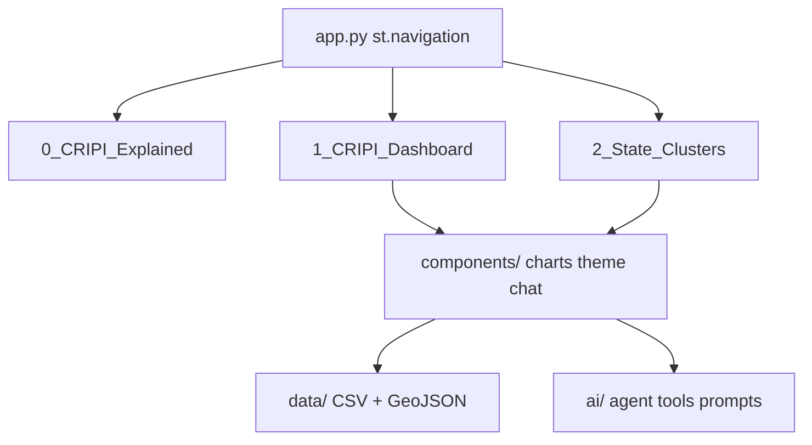
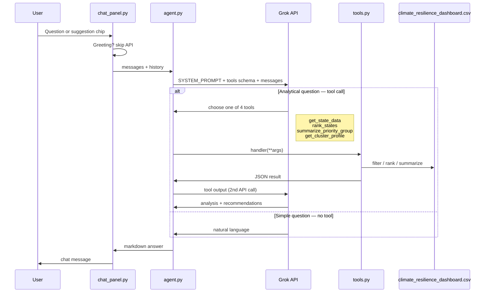

# CRIPI Project Presentation (5 slides, 10 min)

Copy-paste sections for Google Slides / PowerPoint / Canva. Mermaid blocks can be pasted into [mermaid.live](https://mermaid.live) to export PNGs.

## Timing

| Block | Time | Notes |
|-------|------|-------|
| Slides 1–4 | ~4–5 min | ~1 min each; Slide 5 is a 30s handoff |
| Live demo | ~5 min | Follow scripted path below |
| Buffer | ~30s | Transitions / questions |

---

## Slide 1 — Title and problem (45–60 sec)

**Title:** CRIPI Climate Resilience Dashboard  
**Subtitle:** IPCC-informed decision support for Mexico's 32 states

**On slide (3 bullets max):**
- **Problem:** Development agencies need evidence to prioritize climate resilience investments across states with very different vulnerability profiles
- **Solution:** CRIPI index + interactive Streamlit app + AI assistant grounded in official indicators
- **Stack:** Python · Streamlit · Plotly · Grok API · CSV data (no database)

**Speaker note:** One sentence on bootcamp context: adapted from an agent template (Sakila/PostgreSQL) to a domain-specific CSV dashboard for Mexico.

---

## Slide 2 — App structure (60 sec)

**Title:** Three-page Streamlit app

**Diagram (use on slide):**

**On slide — what each page does:**

| Page | Purpose |
|------|---------|
| **CRIPI Explained** | Methodology, audience, navigation |
| **CRIPI Dashboard** | KPIs, Mexico map, state/national profiles, dimension rankings, priority gap, chat |
| **State Clusters** | PCA scatter, cluster profiles, indicator deltas, clusters vs priority, chat |

**Architecture highlights (1 line each):**
- Entry: `app.py` — `st.navigation` with sidebar icons
- Reusable UI: `components/` — charts, KPI cards, `chat_panel.py`, shared theme
- Data: `data/climate_resilience_dashboard.csv` + `data/geo/mexico_states.geojson`
- No classes — simple functions + docstrings (bootcamp-friendly)

---

## Slide 3 — How the agent works (60–75 sec)

**Title:** AI agent: flow, tools, prompts, context

**Flow diagram (use on slide):**

Paste into [mermaid.live](https://mermaid.live) to export PNG, or open [`documents/agent_diagram.mmd`](agent_diagram.mmd).

**Tools (4 — copy this table onto the slide):**

| Tool | When the agent uses it |
|------|------------------------|
| `get_state_data` | Look up specific states, columns, or priority filters; exact values |
| `rank_states` | Top/bottom rankings by CRIPI, a dimension index, or any indicator |
| `summarize_priority_group` | Explain why states in a priority category are similar (vs national mean) |
| `get_cluster_profile` | Cluster membership, dimension profile, distinctive indicators (clusters 1–4) |

**One-line flow for speaking:** User question → Grok picks a tool → Python reads the CSV → JSON back to Grok → natural-language answer with recommendations.

**Context layers in the system prompt** (`ai/prompts.py`):
1. **Persona + rules** — analyst for GIZ-type users; never invent numbers; use IPCC dimensions
2. **Schema** — `ai/cripi_schema.py`: columns, states list, dimension groups
3. **Glossary** — `ai/domain_context.py`: indicator definitions
4. **Conversation history** — separate per page (`messages_priorities` vs `messages_clusters`)

**Speaker note:** Tools return JSON internally; the user sees a markdown reply (bullets, optional small tables). Analytical questions may take 5–10 seconds (two API calls).

---

## Slide 4 — Learnings: agents and coding with Cursor (60 sec)

**Title:** What we learned

**Agents (3 bullets):**
- **Ground the LLM:** Schema + glossary in the system prompt reduced hallucination risk; tools enforce real data
- **Tool design = UX:** Four focused tools beat one giant query function; clear descriptions help Grok pick the right one
- **Two-step synthesis:** Tool → JSON → Grok writes analysis and recommendations; separate chat contexts per page keep conversations relevant

**Coding with Cursor (3 bullets):**
- **Plan before build:** `documents/agent_plan.md` as a product spec; Cursor implemented components incrementally against it
- **Reuse patterns:** Sakila template → swap DB tools for CSV tools; keep `agent.py` + `chat_panel.py` structure
- **Iterate on UI fast:** CSS theme, formatting helpers, doc updates — small focused diffs per feedback round

**Optional one-liner:** Cursor worked best when requirements were specific (“national average when All states selected”) rather than vague (“make it better”).

---

## Slide 5 — Demo handoff (30 sec)

**Title:** Live demo (~5 min)

**On slide — checklist only (you narrate while clicking):**

1. **CRIPI Explained** (30s) — audience + methodology
2. **CRIPI Dashboard** (2 min) — KPIs → map → select Chiapas → state profile → one dimension chart
3. **State Clusters** (1.5 min) — Cluster 1 → PCA map → indicator deltas
4. **Chat** (1 min) — one dashboard question + one cluster question

**Then:** switch to `streamlit run app.py`.

---

## 5-minute demo script (speaker notes)

### 0:00 — CRIPI Explained (30s)
- Scroll intro panel: IPCC dimensions, who it's for
- Point to sidebar: three distinct views

### 0:30 — CRIPI Dashboard (2:00)
- **KPI cards:** Chiapas highest, Nuevo León lowest, range 16.1–56.8
- **Map:** default “All states” → national average profile in 2×2 grid
- **Select Chiapas:** map highlights one state; show sensitivity indicators
- **Quick glance:** Top states by dimension + Very High vs Low gap chart
- Say: “All values grounded in one CSV — 32 states, 12 indicators, 4 dimensions”

### 2:30 — State Clusters (1:30)
- **Cluster 1:** Chiapas, Guerrero, Oaxaca — southern high-sensitivity
- **PCA map:** states grouped by 4 dimension indices; toggle priority colors
- **Indicator deltas:** cluster vs national; highlighted row = most distinctive
- **Cross-tab:** clusters vs CRIPI categories — related but not identical

### 4:00 — Chat (1:00)
- **Dashboard page:** *“Why are Very High Priority states similar?”*  
  — Expect a paragraph on shared dimensions/indicators plus recommendation bullets (`summarize_priority_group`)
- **Clusters page:** *“What makes Cluster 1 distinctive?”*  
  — Expect cluster membership and vs-national profile (`get_cluster_profile`)
- Close: “Same CSV as the charts — four tools, two-step synthesis in the agent”

### Backup if API fails
- Show suggested prompts + explain flow from Slide 3; walk through pre-loaded welcome messages

---

## What NOT to put on slides (save for demo or Q&A)

- Full 12-indicator list
- PCA variance math (unless asked)
- Phase D roadmap details
- Developer_Guide / Sakila migration history (mention briefly only)
